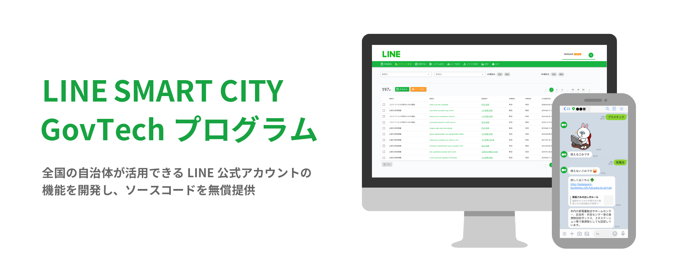
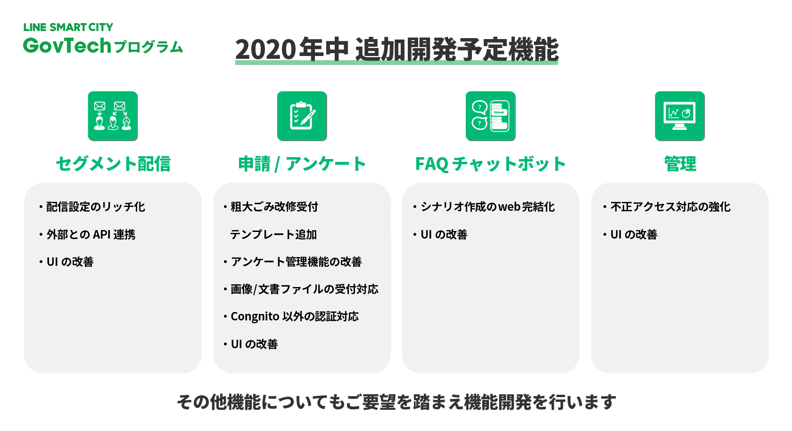

# LINE SMART CITY


[](https://linefukuoka.co.jp/ja/project/smartcityproject/govtech/)

## 「LINE SMART CITY GovTechプログラム」とは？

「LINE SMART CITY GovTechプログラム」とは、LINE公式アカウント追加機能のソースコードを無償で提供するプログラムです。
本プログラムのソースコードを活用することで、全国の自治体はより簡易にLINE公式アカウントへの追加機能の導入が可能です。
詳しくは[「LINE Smart City GovTechプログラム」](https://linefukuoka.co.jp/ja/project/smartcityproject/govtech/)をご覧ください。

### 「LINE SMART CITY GovTechプログラム」で提供する４つの機能  

(1) セグメント配信  
(2) 申請/アンケート機能  
(3) FAQ機能－チャットボット形式応答  
(4) 管理機能  

## 開発者向け情報
開発者向け情報については、こちらの「[開発者向け情報](./docs/DEVELOPERS.md)」をご参照ください。

## 今後のリリース予定
LINE SMART CITY GovTechプログラムのロードマップについては、以下をご参照ください。



## サイトマップ

```
├── LICENSE
├── README.md            // このドキュメント
├── aws_back             // バックエンド
├── aws_web/admin        // 管理画面
├── aws_web/liff         // LIFF
├── aws_web/libraries    // 管理画面・LIFF共通ライブラリ
├── scenario             // シナリオ
├── docs                 // ドキュメント類
├── commands             // lsc.shに呼び出されるコマンド群
├── deploy               // AWS SAM用ファイル
└── lsc.sh               // 環境構築用コマンド
```

## 貢献の仕方
「[LINE Smart Cityにコントリビュートする方法](./CONTRIBUTING_ja.md)」を参照ください。

## お問い合わせ
LINE SMART CITY GovTechプログラムの使い方でわからないことや、不具合など、多くの問題は  
[FAQ](https://help2.line.me/line_govtech_program/web/) を確認することで解決できます。

問題が解決しなかった場合や改善要望がある場合、GitHubの[Issue](https://github.com/linefukuoka/line-smart-city/issues)に詳しい情報をご記入ください。  
また、不具合の場合は問題がわかるスクリーンショットも添付ください。  

※不明点があれば開発チームだけでなく、他の開発パートナーからも質問や提案がある場合があります。