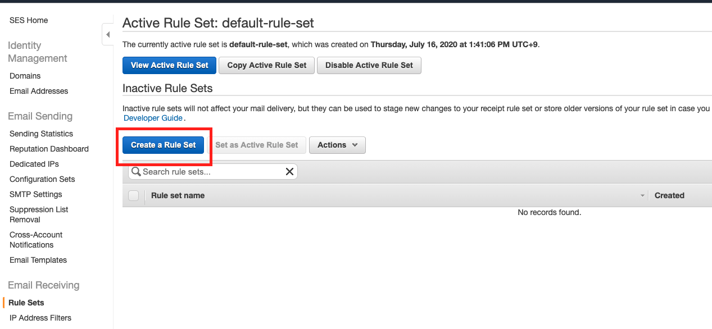
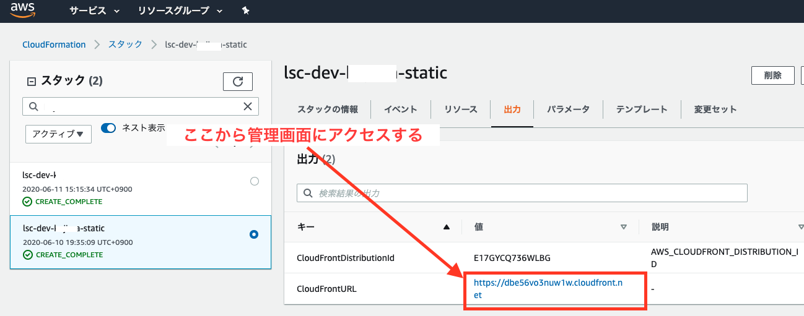
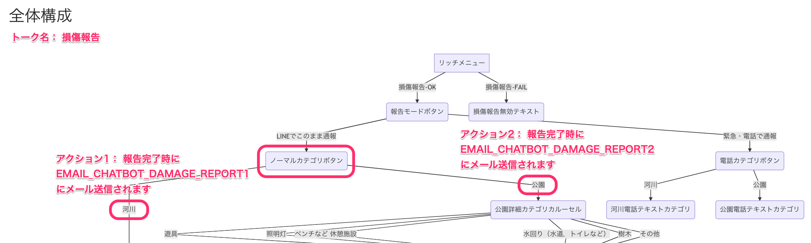

# 開発者向け情報

## 目次
- [1. 事前準備](#1-事前準備)
- [2. 構築手順](#2-構築手順)
    - [2-1. LINE連携](#2-1-line連携)
    - [2-2. 実行](#2-2実行)
    - [2-3. 管理画面](#2-3-管理画面)
- [3. バージョンアップについて](#3-バージョンアップについて)
- [4. ソースコードの開発について](#4-ソースコードの開発について)
- [5. 開発用コマンド一覧](#5-開発用コマンド一覧)

## 1. 事前準備
### 1-1. 実行環境

以下のアプリケーションを、開発を行うローカル環境へインストールします。

| アプリケーション名 | 推奨バージョン | 備考 |
|---|---|---|
| [Node.js](https://nodejs.org/ja/download/) | 12.x, 14.x |
| [Python](https://www.python.jp/install/install.html) | 3.8 | 複数バージョンを管理する場合、[pyenv](https://github.com/pyenv/pyenv) / [pyenv-win](https://github.com/pyenv-win/pyenv-win) の利用を推奨 |
| [AWS CLI](https://docs.aws.amazon.com/ja_jp/cli/latest/userguide/install-cliv2.html) | 2.0以上 |
| [SAM CLI](https://docs.aws.amazon.com/ja_jp/serverless-application-model/latest/developerguide/serverless-sam-cli-install.html) | 1.0以上 |

* Macの場合は `ターミナル`、Windowsの場合は [Git Bash](https://gitforwindows.org/) を立ち上げて作業を行ってください。
* pip ([macOS](https://www.python.jp/install/macos/pip.html) / [Windows](https://www.python.jp/install/windows/pip.html)) で必要なパッケージをインストールしてください。
```bash
$ pip install wheel setuptools
```

### 1-2. リポジトリのクローン

```
$ git clone git@github.com:linefukuoka/line-smart-city.git
```

* **Windowsの場合**
    * スクリプト実行時にエラーとなるため、`commands/package.json` を変更してください。

    変更前）
    ```json
    "scripts": {
        "build:js": "babel src --extensions '.ts' --out-dir built",
    ```

    変更後）
    ```json
    "scripts": {
        "build:js": "babel src --extensions .ts --out-dir built",
    ```

Windowsで上記エラーとなった場合は、パッケージのインストール、ビルドを実施してください。

```
$ cd commands/
$ npm install
$ npm run build
$ cd ..
```

### 1-3. AWSのプロファイル作成

以下の手順でAWSのプロファイルを作成してください。

1. [AWS マネジメントコンソール](https://aws.amazon.com/jp/console/)にアクセスする。
    * AWSアカウントをお持ちでない場合は、AWSアカウントを作成してください。
2. IAMユーザーを作成する
    * アクセス権限は例です。ご利用する環境に応じて調整ください。
    * DevelopmentPartnerPolicy （= PowerUserAccess + Billingのdeny） を作成する。
      ```json
      {
          "Version": "2012-10-17",
          "Statement": [
              {
                  "Effect": "Allow",
                  "NotAction": [
                      "iam:*",
                      "organizations:*",
                      "account:*"
                  ],
                  "Resource": "*"
              },
              {
                  "Effect": "Allow",
                  "Action": [
                      "iam:CreateServiceLinkedRole",
                      "iam:DeleteServiceLinkedRole",
                      "iam:ListRoles",
                      "organizations:DescribeOrganization",
                      "account:ListRegions"
                  ],
                  "Resource": "*"
              },
              {
                  "Effect": "Deny",
                  "Action": [
                      "aws-portal:*Billing",
                      "aws-portal:*Usage",
                      "aws-portal:*PaymentMethods",
                      "budgets:ViewBudget",
                      "budgets:ModifyBudget",
                      "cur:*",
                      "purchase-orders:*PurchaseOrders"
                  ],
                  "Resource": "*"
              }
          ]
      }
      ```
    * DevelopmentPartnerPolicyを付与したDevelopmentPartnerグループを作成する。
    * DevelopmentPartnerグループに追加したIAMユーザーを作成する。
    * ユーザーの「アクセスキー ID」と「シークレットアクセスキー」は、プロファイル作成時に利用します。
3. AWS CLIを利用してプロファイルを作成する。
    * ここでは、プロファイル名を開発環境が`lsc-fukuoka-dev`、ステージング環境が`lsc-fukuoka-stg`、本番環境が `lsc-fukuoka` としています。

```bash
$ aws configure --profile lsc-fukuoka-dev    // プロファイル名
AWS Access Key ID: XXXXXXXXXX                // アクセスキー ID
AWS Secret Access Key: XXXXXXXXXX            // シークレットアクセスキー
Default region name: ap-northeast-1          // リージョン
Default output format:
```

## 2. 構築手順

### 2-1. LINE連携

#### 1. LINE Developersのチャネル作成

下記の手順に従って、LINE Developersの設定を行ってください。

* LINE Developers チャネル設定(Messaging API)
   * [1. スタック作成前の設定](./LINE_DEVELOPERS_SCENARIO.md#1-スタック作成前の設定)
* LINE Developers チャネル設定(LINEログイン)
   * [1. スタック作成前の設定](./LINE_DEVELOPERS_SURVEY.md#1-スタック作成前の設定)

#### 2. 設定情報の反映

「LINE SMART CITY GovTechプログラム」では、設定情報の管理に [AWS Secrets Manager](https://aws.amazon.com/jp/secrets-manager/)を利用しています。  
プロファイル名、環境名 (= AWSプロファイル名 + 開発者名など固有の値) はそれぞれ各自の環境に合った値に変更してください。

**設定例**

| 用途 | プロファイル名 | 環境名 | 備考 |
|---|---|---|---|
| 本番 | lsc-fukuoka | lsc-fukuoka-prod | |
| ステージング | lsc-fukuoka-stg | lsc-fukuoka-stg | |
| 開発 | lsc-fukuoka-dev | lsc-fukuoka-dev-tanaka<br>lsc-fukuoka-dev-suzuki | |

1. シークレット作成  
[環境構築スクリプト（`lsc.sh`）](./COMMANDS.md#1-環境構築スクリプトについて)を使って、シークレットを作成します。
      
```bash
$ ./lsc.sh -e 環境名 -p プロファイル名 secrets create
```

2. SAM用バケットの作成

```bash
$ ./lsc.sh sam createBucket
```

3. シークレット修正

`deploy/secrets_manager/環境名.json` を開き、下記のキーを編集します。

| No | LINE OA | シークレットキー | 内容 | 備考 |
|:---|:---|:---|:---|:---|
| 1 | 本番/ステージング/開発 | LINEMESSAGING_CHANNEL_ACCESS_TOKEN | LINE Messaging APIのチャネルアクセストークン | |
| 2 | 本番/ステージング/開発 | LINEMESSAGING_CHANNEL_ID | LINE Messaging APIのチャネルID | |
| 3 | 本番/ステージング/開発 | LINEMESSAGING_CHANNEL_SECRET | LINE Messaging APIのチャネルシークレット | |
| 4 | サンドボックス | SB_LINEMESSAGING_CHANNEL_ACCESS_TOKEN | LINE Messaging APIのチャネルアクセストークン | ステージング/開発の場合、1と同じ値 |
| 5 | サンドボックス | SB_LINEMESSAGING_CHANNEL_ID | LINE Messaging APIのチャネルID | ステージング/開発の場合、2と同じ値 |
| 6 | サンドボックス | SB_LINEMESSAGING_CHANNEL_SECRET | LINE Messaging APIのチャネルシークレット | ステージング/開発の場合、3と同じ値 |
| 7 | 共通 | VUE_APP_LIFF_ID | LIFF アプリケーションのLIFF ID | |
| 8 | 共通 | SURVEY_LINELOGIN_CHANNEL_ID | LINEログインのチャネルID | |
| 9 | 共通 | SURVEY_LINELOGIN_CHANNEL_SECRET | LINEログインのチャネルシークレット | |
| 10 | 共通 | DISTRIBUTION_MSG_CHANNEL_ACCESS_TOKEN | LINE Messaging APIのチャネルアクセストークン | 1と同じ値 |
| 11 | 共通 | DISTRIBUTION_MSG_CHANNEL_SECRET | LINE Messaging APIのチャネルシークレット | 3と同じ値 |

* 参考：Secrets Managerで設定している値の詳細は、「[環境変数](./SECRETS_MANAGER.md)」を確認してください。

1. シークレット反映  
jsonを編集後、下記を実行してシークレット更新します。
      
```bash
$ ./lsc.sh secrets update
```

### 2-2.実行

#### 1. SESのルールセット作成
us-west-2リージョンに、SESのルールセットが無い場合は作成してください。

1. us-west-2リージョンを選択
2. SESより空のルールセットを作成する
    * Rule set nameは `default-rule-set` を入力



* 参考
  * [Creating a receipt rule set for Amazon SES email receiving（日本語）](https://docs.aws.amazon.com/ja_jp/ses/latest/DeveloperGuide/receiving-email-receipt-rule-set.html)
  * [Creating a receipt rule set for Amazon SES email receiving（英語）](https://docs.aws.amazon.com/ses/latest/DeveloperGuide/receiving-email-receipt-rule-set.html)

#### 2. カスタムドメイン設定
管理画面URLとLIFFでカスタムドメインを設定する場合は、下記を行ってください。

1. [AWS Certificate Manager](https://aws.amazon.com/jp/certificate-manager/) にて証明書発行 (バージニア北部リージョン)
2. [Route53](https://aws.amazon.com/jp/route53/)でのホストゾーン作成や権限移譲
3. シークレット修正

`deploy/secrets_manager/環境名.json` を開き、下記のキーを編集します。

| No | LINE OA | シークレットキー | 内容 | 備考 |
|:---|:---|:---|:---|:---|
| 1 | 共通 | DNS_DOMAIN_LIFF_CERTIFICATE_ID | 発行したACMの識別子 | |
| 2 | 共通 | DNS_DOMAIN_LIFF_HOSTED_ZONE_ID | 作成したホストゾーンのID | |

4. シークレット反映
jsonを編集後、下記を実行してシークレット更新します

```bash
$ ./lsc.sh secrets update
```

5. カスタムドメイン設定を有効にする

```bash
$ ./lsc.sh setupDomain true
```

これでカスタムドメイン設定は完了です。

#### 3. 初期構築
下記のコマンドを実行することで、AWS環境の初期構築を行います。
* 所要時間は約40〜50分です

```bash
$ ./lsc.sh setup
```

* SAMのビルド途中でPython関係のエラーが出る場合は、[Docker](https://www.docker.com/products/docker-desktop)をインストールして起動し、`--useContainer`オプションを付けて実行してください。
    * 例： `$ ./lsc.sh <platform|scenario|survey|distribution> --useContainer setup`

#### 4. LINE Developersのチャネル設定変更
LINE Developersに戻り、下記の手順に従ってチャネルの設定を行ってください。

* LINE Developers チャネル設定(Messaging API)
    * [2. スタック作成後の設定](./LINE_DEVELOPERS_SCENARIO.md#2-スタック作成後の設定)
* LINE Developers チャネル設定(LINEログイン)
    * [2. スタック作成後の設定](./LINE_DEVELOPERS_SURVEY.md#2-スタック作成後の設定)

チャネルの設定完了後、下記コマンドを実行してLIFFアプリのビルド、デプロイを行います。

```bash
# LIFFのビルド、デプロイ
$ ./lsc.sh survey liff refresh
```

#### 5. セグメント配信の受信メールアドレス設定

* AWSコンソールにてSESを開いてメールアドレス設定を実施してください。
    * [セグメント配信の受信メールアドレス設定](./DISTRIBUTION_MAIL_TO_LINE.md)

### 2-3. 管理画面

#### 1. 管理画面のユーザー作成
管理画面の認証で使用するユーザーを作成します。下記を実行します。

```bash
$ ./lsc.sh users
```

* `select what to do` とメニューが出るので「Add」を選択します。
* `Input username` で、ログインするユーザー名を入力します。
    * 最低5文字以上
* `Input mail address` でメールアドレスを入力します（次のステップで設定したパスワードが送られてきます）
* `Select Groups` でユーザーに追加するグループを選択します。
    * デフォルトでは `admins` が選択されています。
    * `admins` 以外のグループについては以下のグループ一覧をご覧ください。
        * グループ一覧
           * `admins`
               * 全権限を保有
           * `members`
               * システム設定・ユーザ設定を除く、運用上の権限を保有
    * `admins` 以外のグループを選択する場合、上下キーで移動してスペースキーで選択します
    * `Select Groups`の選択が完了後、Enterキーで確定します
* `Input password` では、パスワードを英数字8文字以上で入力します。

#### 2. 管理画面へのアクセス

* AWSコンソールからCloudFormationにアクセスし、スタック名（環境名 + `-platform-static`）の出力タブにある`CloudFrontURL`にアクセスすると管理画面が見れます
* 「管理画面のユーザー作成」で作成したユーザー名・パスワードでログインします。


#### 3. シナリオ設定
LINE公式アカウントを利用できる状態にするため、シナリオ設定を行います。  
シナリオ設定については、「[管理画面 | シナリオ設定](./LINE_SCENARIO_SETTING.md)」をご参照ください。

#### 4. 損傷報告先メールアドレスの設定
損傷報告先メールアドレスを設定します。

* 管理画面にログインする
* メニューより「システム設定 > AWS設定」を選択
* 以下項目を入力

| No | LINE OA | シークレットキー | 内容 | 備考 |
|:---|:---|:---|:---|:---|
| 1 | 共通 | EMAIL_CHATBOT_DAMAGE_REPORT1 | 損傷報告メールアドレス1 | シナリオ設定 「ノーマルカテゴリボタン」の「アクション1」完了時の送信先メールアドレス |
| 2 | 共通 | EMAIL_CHATBOT_DAMAGE_REPORT2 | 損傷報告メールアドレス2 | シナリオ設定 「ノーマルカテゴリボタン」の「アクション2」完了時の送信先メールアドレス |
| 3 | 共通 | EMAIL_CHATBOT_DAMAGE_REPORT3 | 損傷報告メールアドレス3 | シナリオ設定 「ノーマルカテゴリボタン」の「アクション3」完了時の送信先メールアドレス |
| 4 | 共通 | EMAIL_CHATBOT_DAMAGE_REPORT4 | 損傷報告メールアドレス4 | シナリオ設定 「ノーマルカテゴリボタン」の「アクション4」完了時の送信先メールアドレス |

* 「保存」ボタンをクリックして、損傷報告先メールアドレスを保存する

#### 損傷報告先メールアドレスの利用箇所
* EMAIL_CHATBOT_DAMAGE_REPORT1〜4は、シナリオ設定 「ノーマルカテゴリボタン」のアクション1〜4で利用されます。

##### 例）
シナリオ設定 > サンドボックス > 編集 > 「トーク名：損傷報告」



## 3. セキュリティ設定

* パスワードのポリシーを変更する
    * 管理画面にログインする
    * メニューより「ユーザ設定 > ポリシー設定」を選択
    * パスワードのポリシーを変更する

* IPアドレス制限
    * AWSコンソールにてAWS WAFを開いてIPアドレス制限を実施してください。
        * [IPアドレス制限](./AWS_IPアドレス制限.md)

## 4. バージョンアップについて
### 1. リモートリポジトリの変更内容を取り込む

```
$ git remote -v
origin	git@github.com:linefukuoka/line-smart-city.git (fetch)
origin	git@github.com:linefukuoka/line-smart-city.git (push)

# git pull origin main
```

### 2. 全環境の更新
下記を実行することで、環境を全て更新します。

※ 時間がかかりますので、一部だけ更新する場合は個別に行ってください（「[モジュール単位の更新](./COMMANDS.md#モジュール単位の更新)」参照）

```bash
$ ./lsc.sh refresh
```

## 5. ソースコードの開発について

### 1. 開発方法
1. `commands/src/`内のファイルを編集します
    1. `npm run watch`で監視するか、`npm run build`の実行でビルドをします
2. `commands/test/`内にユニットテストコードを記載します
    1. `npm run test` を実行しユニットテストの確認を行います
3. 実際に`./lsc.sh`を実行して動作確認をします

### 2. 命名規則やコードのフォーマット
* 命名規則
    * モジュール名（フォルダやファイル名）はハイフンケースとします
    * 目的が不明確な名前の付け方を極力避けるようにします
        * 例えば、`common` や `general` というモジュール名にすると用途が広すぎるので、管理がしづらくなります
* ソースコードのフォーマット
    * 関数名や変数名は、キャメルケースで書いてください（例: `someFunction()`, `someConst`）
    * クラス名はアッパーキャメルケースで書いてください。但し略称などの場合はアッパーケースも可とします
        * 例：`SampleClass`, `SAMConfig` など

### 3. copyrightヘッダの追加
* すべてのソースファイルは、次のcopyrightヘッダーで始まる必要があります。

```
/*
 * Copyright $today.year LINE Fukuoka Corporation
 *
 * LINE Corporation licenses this file to you under the Apache License,
 * version 2.0 (the "License"); you may not use this file except in compliance
 * with the License. You may obtain a copy of the License at:
 *
 *   https://www.apache.org/licenses/LICENSE-2.0
 *
 * Unless required by applicable law or agreed to in writing, software
 * distributed under the License is distributed on an "AS IS" BASIS, WITHOUT
 * WARRANTIES OR CONDITIONS OF ANY KIND, either express or implied. See the
 * License for the specific language governing permissions and limitations
 * under the License.
 */
```

## 4. 開発用コマンド一覧
「[開発用コマンド一覧](./COMMANDS.md)」をご参照ください。
